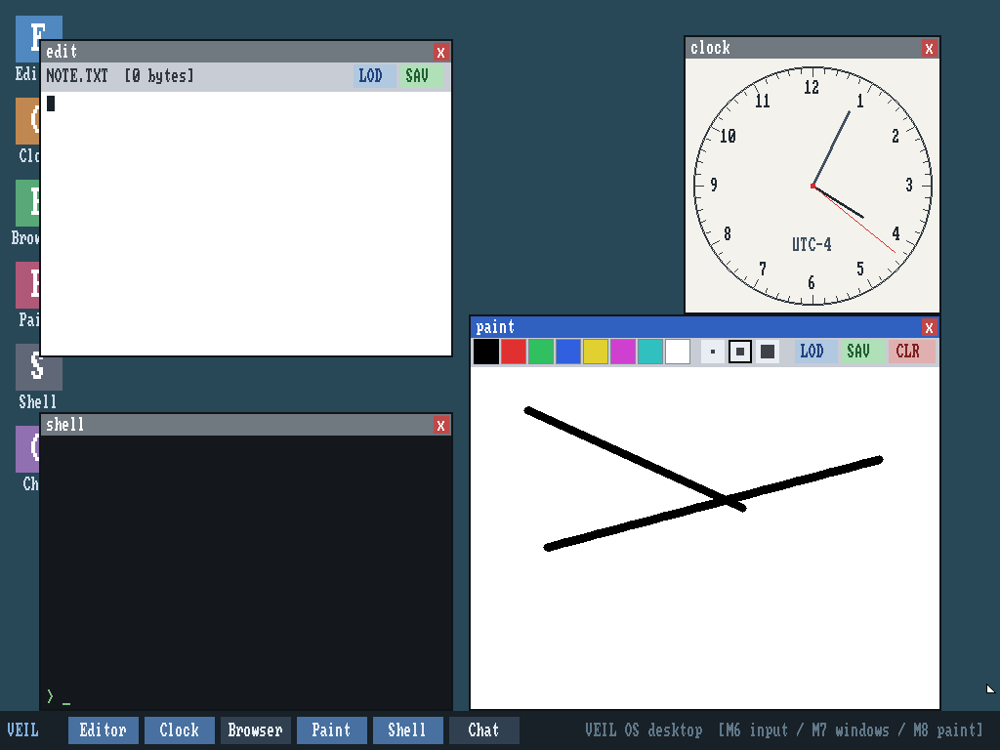

# Veil OS

A graphical operating system for 64-bit ARM (AArch64), written from
scratch in Rust — no Linux, no BSD, no borrowed kernel, no network
library. Its own bootstrap, MMU and paging, heap, preemptive scheduler,
user mode, FAT16 driver, TCP/IP stack, window manager, and a handful of
native apps. It boots on QEMU's `virt` machine and on a real Raspberry
Pi 4.



## Try it

**Live demo:** <https://os.henryratterman.com> — a real instance running
in your browser. Click around, paint something, open the browser, watch
the clock. (Resets every 30 minutes.)

**Run it locally (macOS):**

```bash
brew install qemu && git clone https://github.com/hratterman/veil-os && cd veil-os && scripts/demo.sh
```

That builds the disk image and boots the OS in a native window with
working mouse, keyboard, and internet.

## What's in it

Everything below is implemented from first principles. Each milestone was
gated behind an automated proof that boots the OS in QEMU and verifies the
behavior — pixels on screen, packets on the wire, files on disk.

| # | Milestone | What it proves |
|---|-----------|----------------|
| M1 | Serial boot | Bare-metal AArch64 bring-up, UART output |
| M2 | Exceptions + timer | GICv2, traps survive, generic timer ticks |
| M3 | Paging + MMU | Frame allocator from the DTB, 3-level page tables |
| M4 | Kernel heap | Free-list allocator under alloc/free stress |
| M5 | Framebuffer | fw_cfg + ramfb, lines/rects/bitmap font |
| M6 | Input | virtio keyboard + tablet (absolute pointer) |
| M7 | Window manager | Compositor, drag, focus, z-order |
| M8 | Paint | Palette, brushes, persistent canvas |
| M9 | User mode | EL0 processes, syscalls, memory isolation |
| M10 | Disk | virtio-blk + a from-scratch FAT16 driver |
| M11 | Shell | Preemptive scheduling, a real shell |
| M12–M15 | Networking | Ethernet, ARP, IPv4, ICMP, UDP, TCP, HTTP server |
| M16 | Browser | An on-OS browser (HTML/CSS/PNG) over our own TCP |
| M17 | Raspberry Pi 4 | The same kernel boots on real BCM2711 hardware |
| M18 | Text editor | Edit and save files to disk |
| M19 | Clock | Analog + digital faces, chronograph, stopwatch |
| M19b | NTP | Resolves pool.ntp.org over our DNS, sets real local time |
| M20 | Global chat | Two from-scratch OSes talking over real UDP |
| M21 | Release + hosted demo | This page; the browser-playable instance |
| M22 | Polish | Paint persistence verified, regression suite green |
| M23 | Image viewer | Browse PNGs from disk |
| M24 | Audio | Native WAV playback over Intel HDA |

## Build from source

You need a Rust nightly-ish toolchain with the `aarch64-unknown-none`
target and `llvm-tools`, plus QEMU:

```bash
rustup target add aarch64-unknown-none
rustup component add llvm-tools
brew install qemu
scripts/build.sh      # builds user binaries + the kernel
scripts/demo.sh       # build the disk and boot the desktop
```

The Raspberry Pi 4 image is built with `scripts/mkpi.sh` (see `pi/`).

## How it's tested

Reality is the grader. Every milestone has a proof script under `scripts/`
that boots the actual kernel in QEMU and checks observed behavior:

- `scripts/test.sh <sentinel>` — headless serial checks (M1–M4, M9–M11)
- `scripts/gui_test.sh`, `scripts/run_gui.sh <driver.py>` — pixel-level GUI
  proofs driven over QMP
- `scripts/net_test.sh` — the network gauntlet (raw frames, ARP/ICMP/UDP,
  TCP handshake + teardown captured in a pcap, real `curl`/browser fetches)
- `scripts/m19b_test.sh` — real NTP sync over the internet

## Constraints (deliberately out of scope)

No TLS, no JavaScript engine, no loading of Linux/Windows binaries, single
core (no SMP). The goal was breadth built honestly, not a production OS.

## License

MIT — see [LICENSE](LICENSE).
